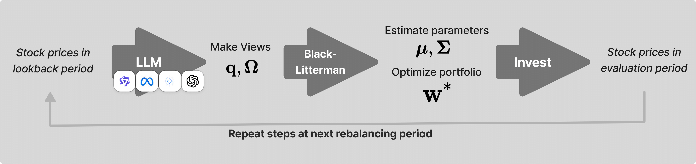
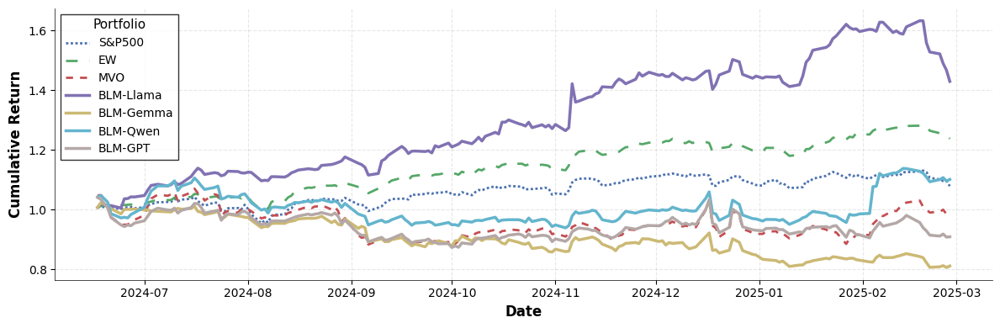
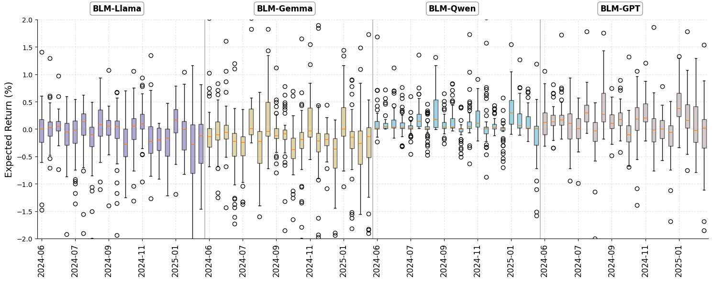
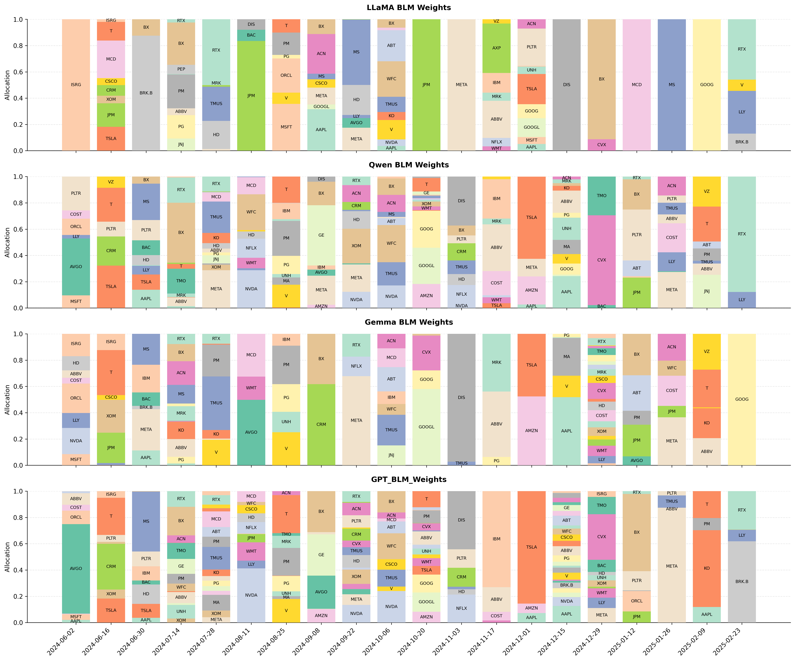

# Project for my Master's essay based on the Black-Litterman Model - LLM project written by Youngbin Lee, Yejin Kim and Juhyeong Kim (https://github.com/youngandbin/LLM-BLM)
 - The main improvement to add is in the input data fed to LLMs. Instead of only using historical price data, we can enhance the input by including yearly and quarterly financial statements.
 
 - High level list of changes made to the original project:
    - Changed usage of yfinance to instead use dataset from McGill-Fiam Hackathon 2025 for returns data.
       - This dataset is monthly instead of daily. Therefore, the portfolio is rebalanced monthly instead of bi-weekly like originally.
    - Added yearly and quarterly financial statements data as input to LLMs.
    - Extended the time period of analysis from January 2015 to June 2025.
    - Used different versions of LLM models (gpt-4o-mini was ran on OpenAI servers and the others locally).
    - Added a new step in the pipeline: summarize_text_reports.py to summarize financial statements before feeding them to LLMs through GPT-4o-mini.
    - Changed name of some files to better reflect their purpose.
    - Added a Viewless Black-Litterman portfolio as a benchmark.
    - Reduced the number of requests to LLMs from 30 to 5 per stock per month to reduce costs and speed up the process. (We input more data so responses take longer to generate).
       - The dispersion of response is therefore computed on only 5 responses instead of 30.

 - The readme from the original repository is as follows:

# Integrating LLM-Generated Views into Mean-Variance Optimization Using the Black-Litterman Model 

 > This is an official implementation of the paper [Integrating LLM-Generated Views into Mean-Variance Optimization Using the Black-Litterman Model](https://arxiv.org/abs/2504.14345), presented at ICLR 2025 Workshop on Advances in Financial AI.



## Project Structure

```
.
├── run.py                  # Main file to run LLMs and collect their views
├── baselines.py           # Implementation of baseline portfolio strategies
├── calculate_llm_returns.py # Calculates returns for LLM-based portfolios
├── evaluate_multiple.py    # Evaluates multiple portfolio strategies
├── responses/             # Stores LLM predictions and views
├── responses_portfolios/  # Contains baseline portfolio weights and returns
├── results/              # Final evaluation results
└── yfinance/             # Downloaded stock price data
```

## Workflow Description

### 1. Data Collection and LLM Views (`run.py`)
- Downloads S&P 500 stock price data using yfinance API
- Data is stored in the `yfinance/` directory
- Queries different LLM models (Qwen, LLaMA, Gemma, GPT) for stock return predictions
- LLM responses are stored in `responses/` directory as JSON files

### 2. Baseline Portfolio Construction (`baselines.py`)
- Implements two baseline portfolio strategies:
  1. Equal-weighted portfolio
  2. Mean-variance optimized portfolio
- Processes data monthly from June 2024 to February 2025
- Portfolio weights and returns are stored in `responses_portfolios/`

### 3. Portfolio Evaluation
The evaluation process is split into two main components:

#### a. LLM Returns Calculation (`calculate_llm_returns.py`)
- Processes the LLM-based portfolio weights
- Calculates portfolio returns for each LLM strategy
- Results are stored in `results/` directory

#### b. Multiple Strategy Evaluation (`evaluate_multiple.py`)
- Implements Black-Litterman portfolio optimization using LLM views
- Processes multiple time periods
- Generates final performance metrics and comparisons
- Stores final evaluation results in `results/` directory





## File Descriptions

### Main Files
- `run.py`: Main entry point for collecting LLM views on stock returns
- `baselines.py`: Implements baseline portfolio construction strategies
- `calculate_llm_returns.py`: Calculates returns for LLM-based portfolios
- `evaluate_multiple.py`: Evaluates and compares different portfolio strategies

### Directories
- `responses/`: Contains JSON files with LLM predictions for each stock
- `responses_portfolios/`: Stores baseline portfolio weights and returns
- `results/`: Contains final evaluation results and performance metrics
- `yfinance/`: Stores downloaded stock price data and returns

## Usage

1. Run LLM predictions:
```bash
python run.py --model_name [qwen|llama|gemma|gpt]
```

2. Generate baseline portfolios:
```bash
python baselines.py
```

3. Calculate returns and evaluate strategies:
```bash
python calculate_llm_returns.py
python evaluate_multiple.py
``` 
